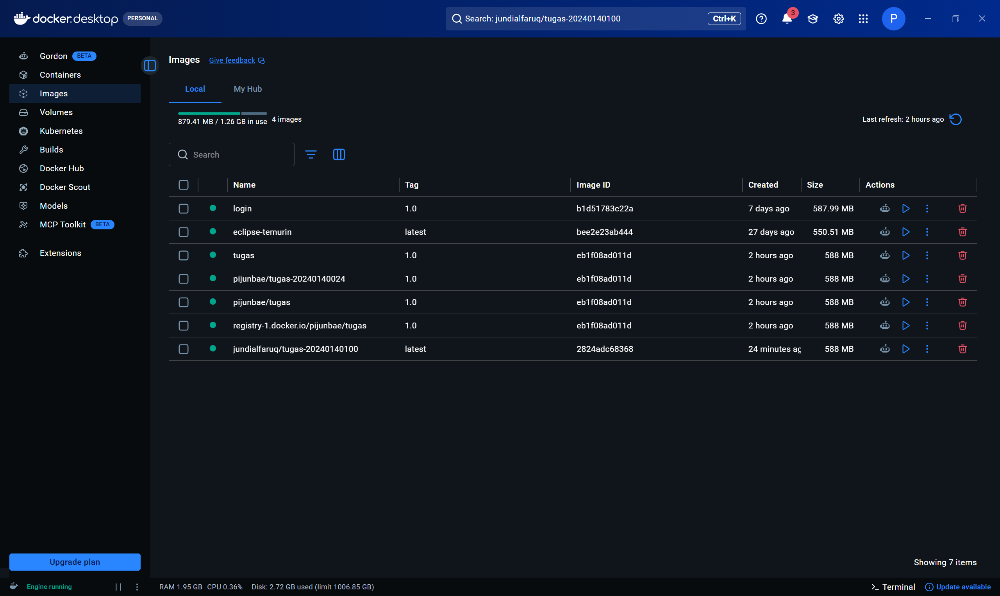
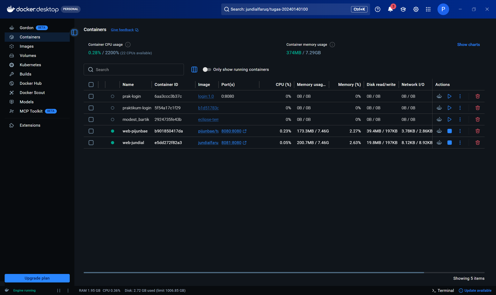
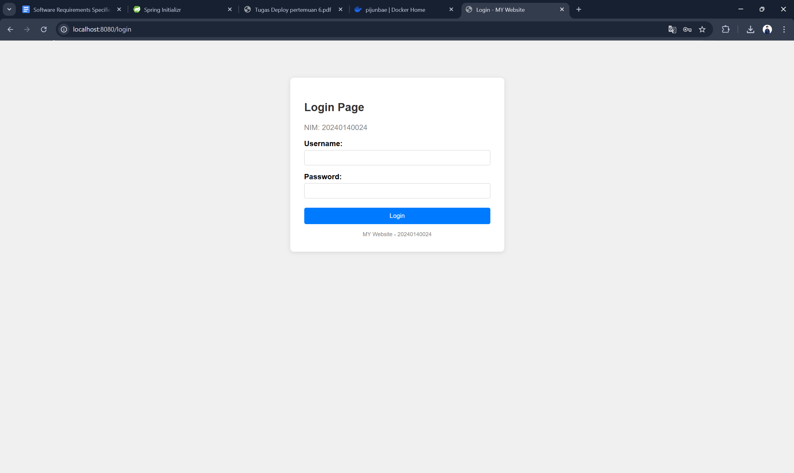
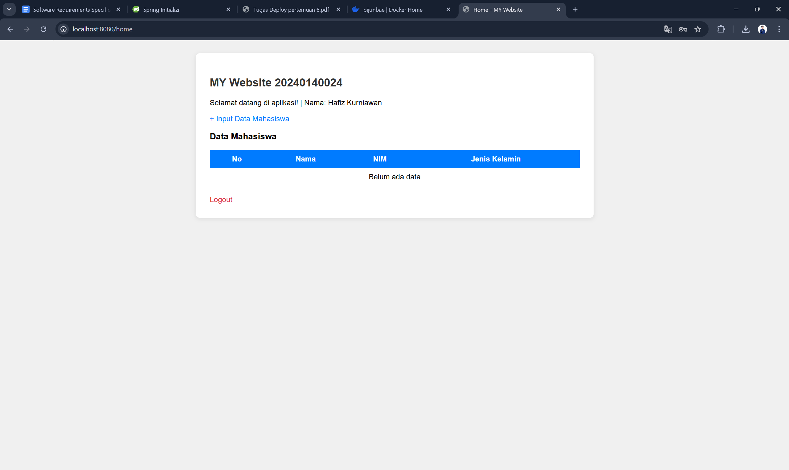
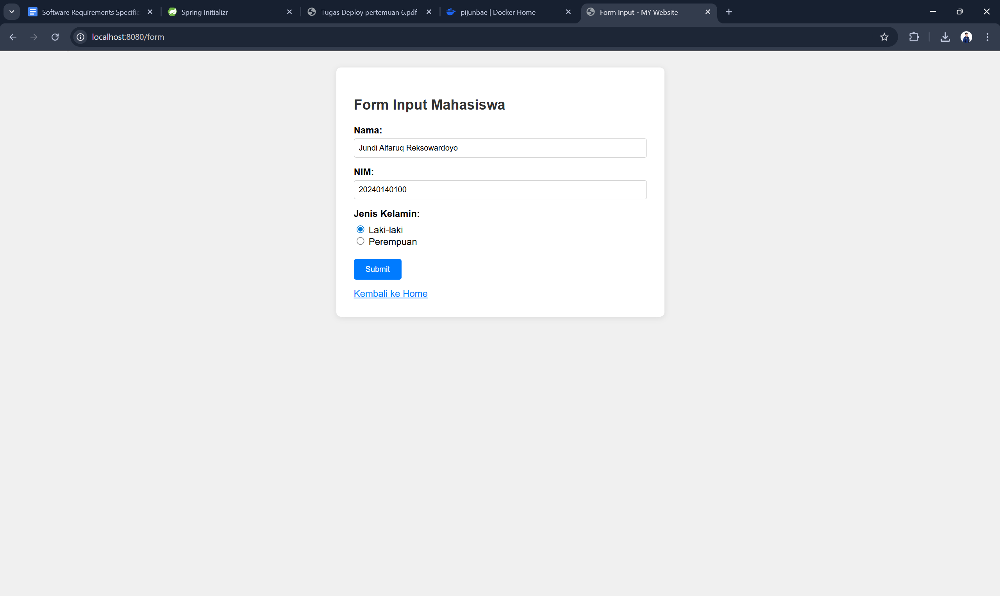
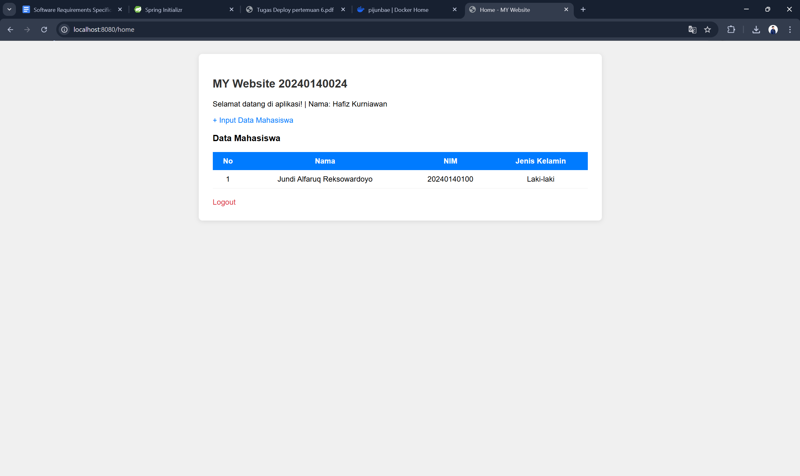
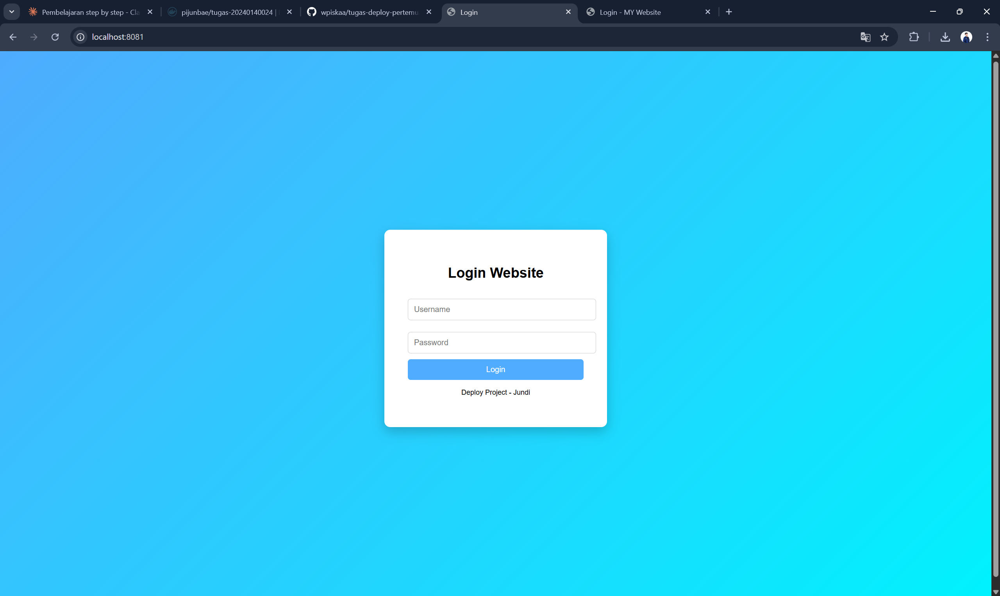
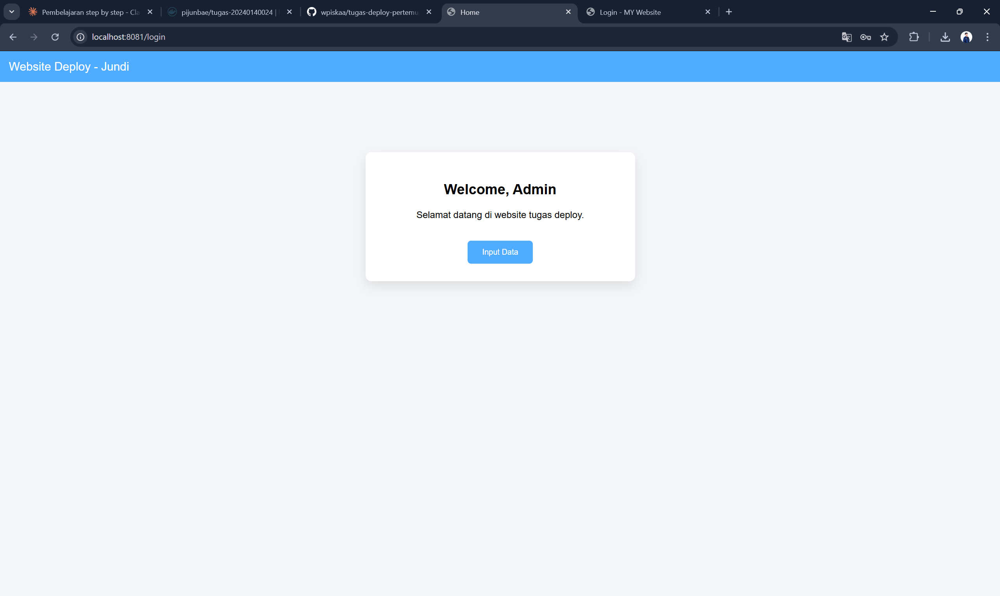
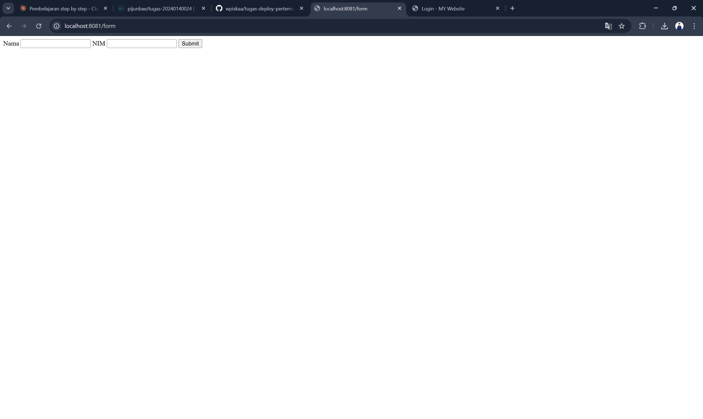
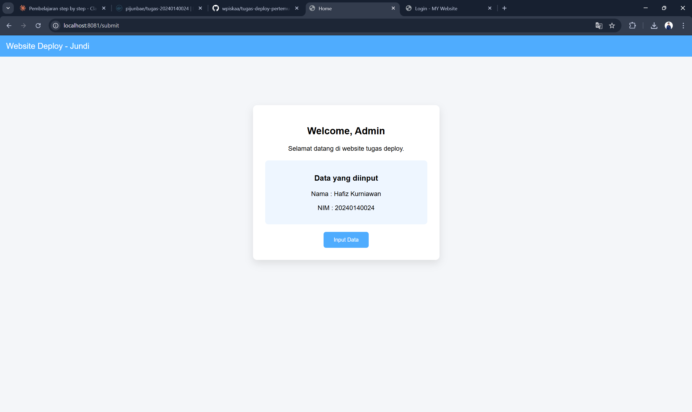

# Tugas Deploy Pertemuan 6
**Nama:** Hafiz Kurniawan
**NIM:** 20240140024 
**Mata Kuliah:** Software Deployment

---

## Deskripsi
Website sederhana menggunakan Spring Boot + Thymeleaf dengan fitur:
- Login (username: admin, password: NIM)
- Input data mahasiswa (temporary, tidak menggunakan database)
- Dideploy menggunakan Docker

---

## Teknologi yang Digunakan
- Java 25
- Spring Boot 4.0.5
- Spring Web
- Thymeleaf
- Lombok
- Docker

---

## Screenshot

### 1. Halaman Image Docker Desktop

### 2. Halaman Container Docker Desktop

### 3. Website Sendiri

#### Login

#### Home

#### Form Input

#### Home Setelah Input

### 4. Website Teman (yang di-pull)

#### Login Teman

#### Home Teman

#### Form Teman

#### Home Teman Setelah Input
