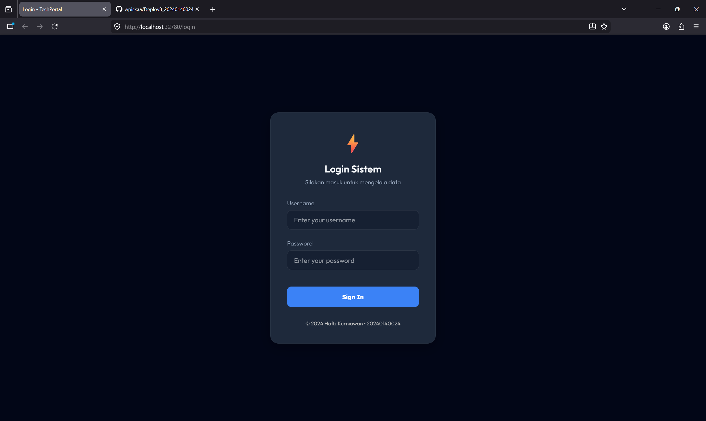
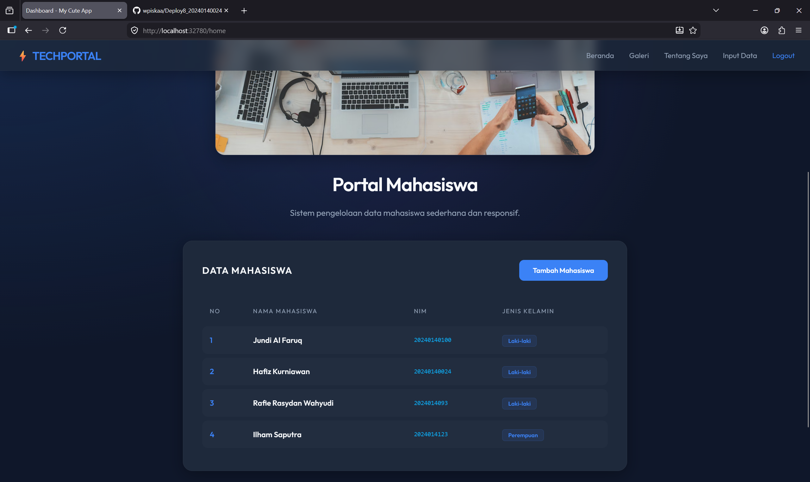
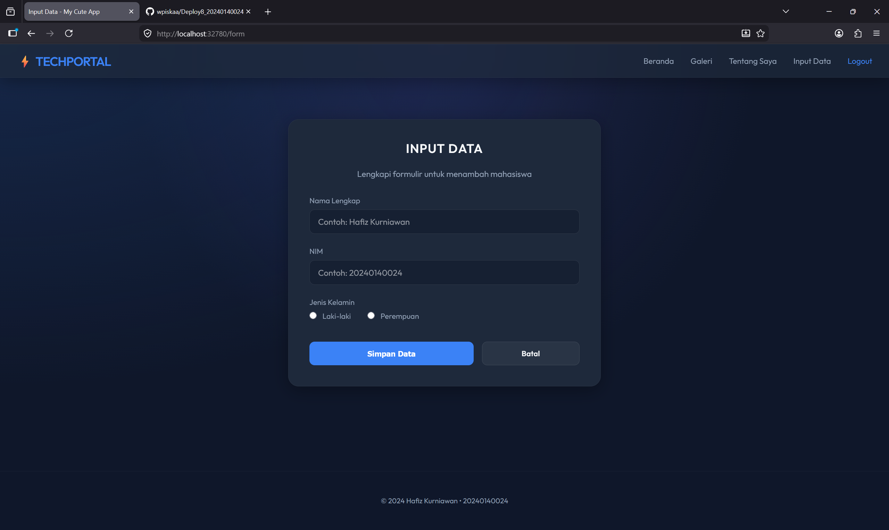
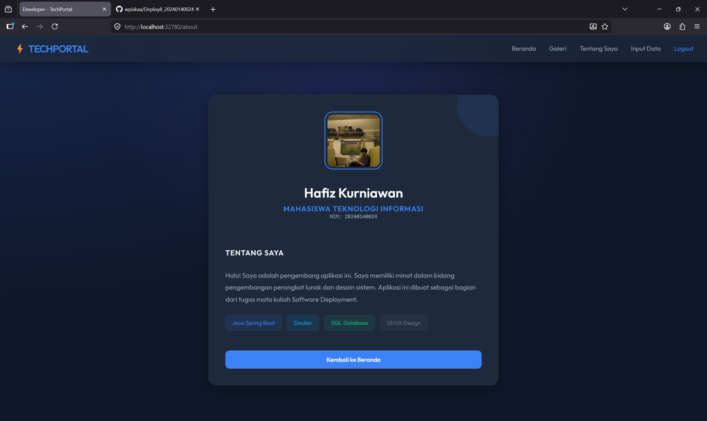
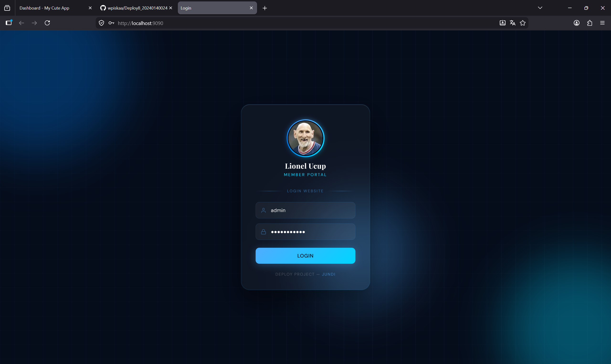
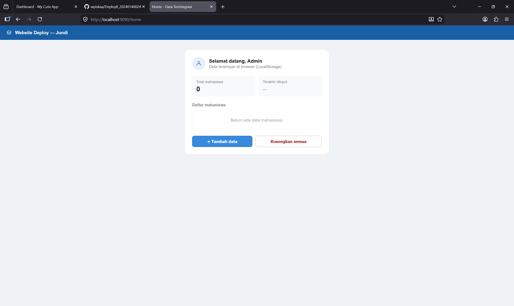
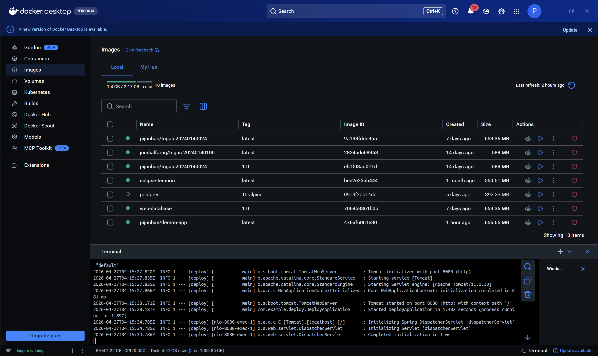
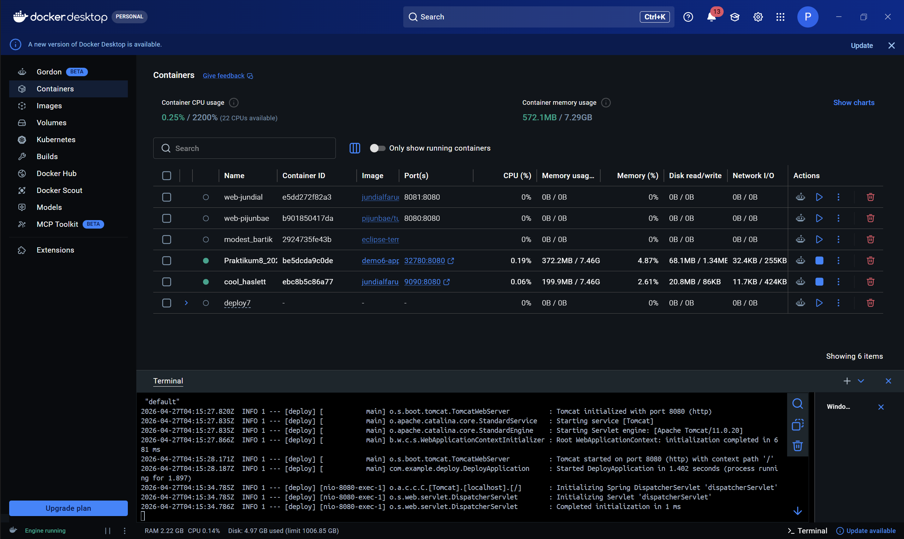

# 📱 Vibes - Social Media Minimalis (Tugas Praktikum Deployment)

Vibes adalah aplikasi media sosial minimalis berbasis web yang dibangun menggunakan **Spring Boot** dan antarmuka **Thymeleaf**. Aplikasi ini merupakan hasil transformasi dari sistem informasi mahasiswa menjadi platform *micro-blogging* dengan tema **Dark Moon** (Desktop Layout). Proyek ini dibuat untuk memenuhi tugas mata kuliah **Software Deployment Pertemuan 6**.

---

## 🚀 Fitur Utama
1. **Autentikasi Sederhana**: Sistem login aman dengan verifikasi username dan password.
2. **Dashboard Data Mahasiswa**: Menampilkan daftar mahasiswa yang terintegrasi secara dinamis (Portal Mahasiswa).
3. **Manajemen Data**: Fitur untuk menambah data mahasiswa baru melalui formulir input yang responsif.
4. **Halaman Tentang Saya**: Informasi profil pengembang aplikasi beserta teknologi yang digunakan.
5. **Responsif & Modern**: Antarmuka dengan tema **Dark Moon** yang elegan dan nyaman di mata.

---

## 🛠️ Teknologi yang Digunakan
* **Backend**: Java 25, Spring Boot 3.x
* **Frontend**: HTML5, Vanilla CSS3 (Tema Desktop Dark Moon), Thymeleaf
* **Database**: H2 Database (In-Memory / File-based)
* **Deployment**: Docker & Docker Hub

---

## 📸 Dokumentasi Antarmuka (Screenshots)

Berikut adalah tampilan antarmuka dari aplikasi **TechPortal** yang telah dijalankan:

### 1. Halaman Login

*Antarmuka login sistem dengan desain minimalis.*

### 2. Halaman Beranda (Portal Mahasiswa)

*Menampilkan tabel data mahasiswa yang telah tersimpan di sistem.*

### 3. Halaman Input Data

*Formulir untuk menambahkan data mahasiswa baru ke dalam database.*

### 4. Halaman Tentang Saya (Profil)

*Informasi profil pengembang aplikasi (Hafiz Kurniawan).*

---

## 👥 Dokumentasi Antarmuka Teman (Screenshots)

Berikut adalah bukti dokumentasi aplikasi yang dijalankan oleh rekan saya (**Jundi**):

### 1. Halaman Login Teman

*Antarmuka login milik Jundi dengan kustomisasi personal.*

### 2. Dashboard Teman (Website Deploy — Jundi)

*Aplikasi berhasil berjalan dan diakses di perangkat rekan saya.*

---

## 🐳 Dokumentasi Docker

Aplikasi ini telah di-*containerization* menggunakan Docker agar dapat diakses dan dijalankan dengan mudah pada lingkungan apapun.

### 1. Docker Images
Berikut adalah *screenshot* daftar image di Docker Desktop:


*(Atau via CLI)*
```bash
$ docker images
REPOSITORY             TAG       IMAGE ID       CREATED          SIZE
demo6-app              latest    ea540fd11083   10 minutes ago   385MB
pijunbae/demo6-app     latest    ...            ...              ...
```

### 2. Docker Containers
Berikut adalah *screenshot* container yang sedang berjalan mem-binding port:


*(Atau via CLI)*
```bash
$ docker ps
CONTAINER ID   IMAGE       COMMAND                  CREATED          STATUS          PORTS                    NAMES
ea540fd11083   demo6-app   "java -jar /app.jar"     10 minutes ago   Up 10 minutes   0.0.0.0:8080->8080/tcp   demo6-container
```

---

## ⚙️ Cara Menjalankan Aplikasi (Instruksi Tarik dari Docker Hub)

Untuk menjalankan aplikasi ini di komputer teman atau mesin lain, cukup gunakan perintah Docker berikut:

**1. Jalankan Container (Akan otomatis Pull dari Docker Hub jika belum ada)**
```bash
docker run -d -p 8080:8080 --name vibes-app pijunbae/demo6-app:latest
```
*(Catatan: pastikan Anda sudah melakukan `docker push pijunbae/demo6-app` terlebih dahulu).*

**2. Akses Aplikasi**
Buka browser dan kunjungi:
👉 [http://localhost:8080](http://localhost:8080)

**3. Kredensial Login**
* **Username**: `admin`
* **Password**: `20240140024`

---
*Dibuat oleh Hafiz Kurniawan (20240140024) - 2024*